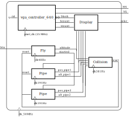

# VHDL Blobbyfish

Blobbyfish est un projet VHDL développé par un groupe de projet en SAPHIRE-EEA.

C'est un clone de Flappybird mais en VHDL.

Ce projet est sous [licence GPLv3](LICENSE).

## Structure du programme

## TODO-list

  - Randomize pipe altitude,
  - BCD counter for score.
